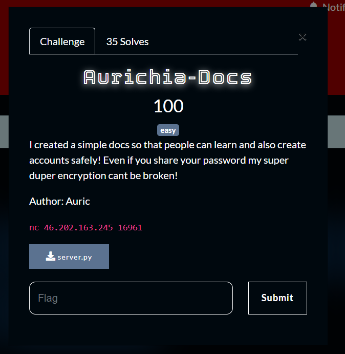

What you need to solve :
- Basic concept of caesar cipher

---

```
#!/usr/bin/python3
from auric import secret_shift, kebaikan_auric, flag
import time

alphabets = 'abcdefghijklmnopqrstuvwxyzABCDEFGHIJKLMNOPQRSTUVWXYZ0123456789'

user_create = False

def encrypt(yesyes):
    for shift in range(secret_shift):
        res = ''
        for i in range(len(yesyes)):
            if yesyes[i].isalnum():
                res += alphabets[(alphabets.index(yesyes[i]) + shift) % len(alphabets)]
            else:
                res += yesyes[i]
    return res

def register():
    name = input("name : ")
    password = input("password : ")
    if user_create == True:
        cipher = encrypt(password)
        with open("user.db", 'a') as a:
            a.write(f"{name},{cipher}\n")
            a.close()
        print(f"registered {name}")
    else:
        print("User account creation is not available")
        print("heres a gift from auric", kebaikan_auric)

def login():
    name = input("name : ")
    userpass = input("password : ")
    data = open("user.db", 'r')
    count = 0
    password = encrypt(password)
    for i in data:
        username, password = i.strip().split(',')
        # print(f"{count}",username, password)
        count += 1
        if name == 'fuwawa' and name == username and userpass == password:
            print(flag)
            return;
        elif name == username and password == password:
            print("Welcome back", name)
            return;
    print("Wrong Username or Password please recheck!")

def docs():
        print("best docs for tutorials")
        print("1. what are encodings?")
        print("2. what are encryptions")
        print("3. what is RSA?")
        pick = int(input("pick a docs : "))
        if pick > 3 or pick < 1:
            print("Not Found!")
        else:
            fname = "docs/"
            fname += str(pick)
            with open(fname, 'r') as a:
                for i in a:
                    print(i.strip())

def leak():
    with open("chat.txt", 'r') as a:
        for i in a:
            print(i.strip())
            time.sleep(0.7)

def main():
    while(True):
        print("aurichia docs")
        print("1. see docs")
        print("2. login")
        print("3. register")
        print("4. Exit")
        try:
            user = int(input("input : "))
            if user == 3:
                register()
            elif user == 2:
                login()
            elif user == 1:
                docs()
            elif user == 4:
                break;
            elif user == 69: # note for developer : dont forget to delete this!
                leak()
        except:
            print("invalid input!")

if __name__ == '__main__':
    main()
```

From the code above we can already see the problem, the problem is even if the shift is hidden we can just always bruteforce the challenge!

But first we need to get fuwawa's password because,

```
if name == 'fuwawa' and name == username and userpass == password:
            print(flag)
            return;
```

From this line we know that only fuwawa gets the flag but how do we do that?

While reading the source code we can see that there is a Leak() function that was called if we put the value 69 into the menu, so lets try that!


So it looks like a chat between auric and fuwawa, but! The interesting thing is that fuwawa leaked her own password that looks like encrypted!

Knowing that this cipher is just a simple caesar cipher which shifts a character by a key (secret shift), we can easily bruteforce her password if we go through all the possibilities!

```
>>> password = "ZChcVwLdr3htFFSlhFFsrhFFlEUDfGr9Jd58ui9Mk8fChEq"
>>> alphabets = 'abcdefghijklmnopqrstuvwxyzABCDEFGHIJKLMNOPQRSTUVWXYZ0123456789'
...
... def encrypt(yesyes):
...     for shift in range(100):
...         res = ''
...         for i in range(len(yesyes)):
...             if yesyes[i].isalnum():
...                 res += alphabets[(alphabets.index(yesyes[i]) + shift) % len(alphabets)]
...             else:
...                 res += yesyes[i]
...         print(res)
...
>>> encrypt(password)
```

The code above i created from the command line, basicly it will print out every possibility by printing all of the shifts!


From the image above as you can see we can see the original password that is :
`Il0VEfuWaM0cooB40ooba0oo4nDmYpaSsWORd1Sv3RYl0n9`

We can then login with the password that we found to fuwawa's account!


Flag : CSC{https://youtu.be/_-2dIuV34cs?si=hN4Ho2KEyeixeLrR}