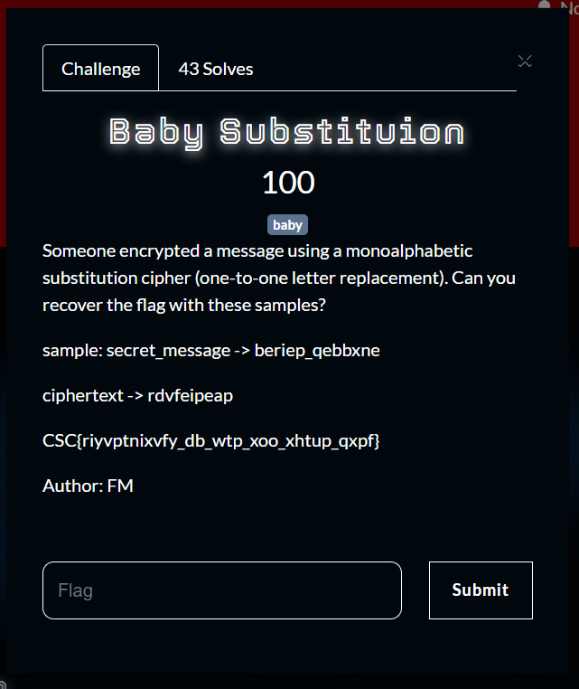
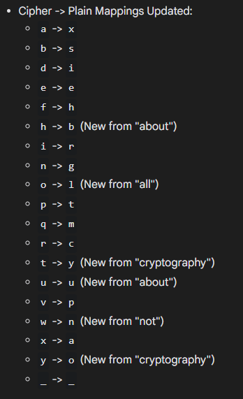
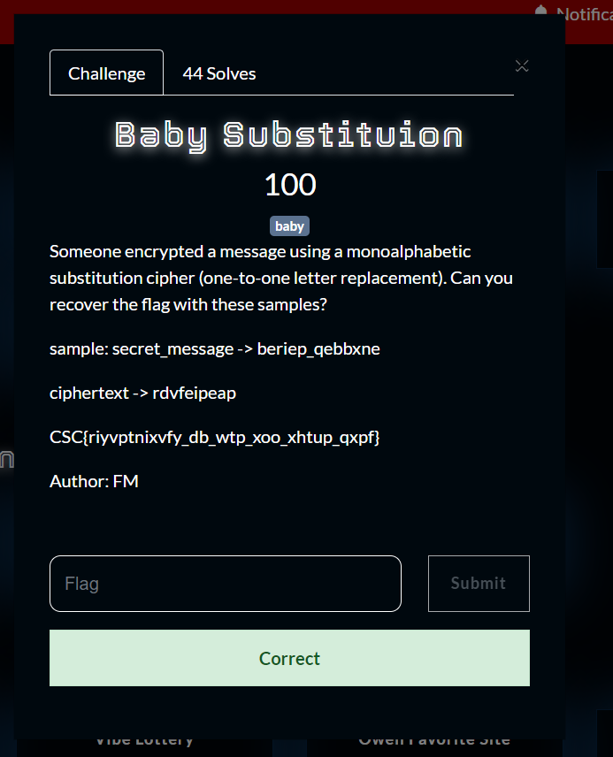

What you need to solve :
- Basic concept of Substitution Cipher

---

So this challenge is a very classic cryptography challenge based on Substitution Cipher, What is that you may ask?

basicly in substitution every alphabet will point to another alphabet,

As an example imagine we have the table of alphabets that point to another like

```
a -> r
b -> e
c -> n
d -> k
e -> o
```

When we encrypt the word `abcde` we will first check what does the character `a` points to? So it points to r then we will check one by one until we get the ciphertext `renko`.

Decrypting it is pretty straightforward if we have the table we can just reverse the process to get back `abcde`.

---

Solving this challenge because this challenge takes lots of time knowing the basic concepts i will use ai,



We can implement the table that the ai found to solve this challenge and get the flag!



Flag : CSC{cryptography_is_not_all_about_math}