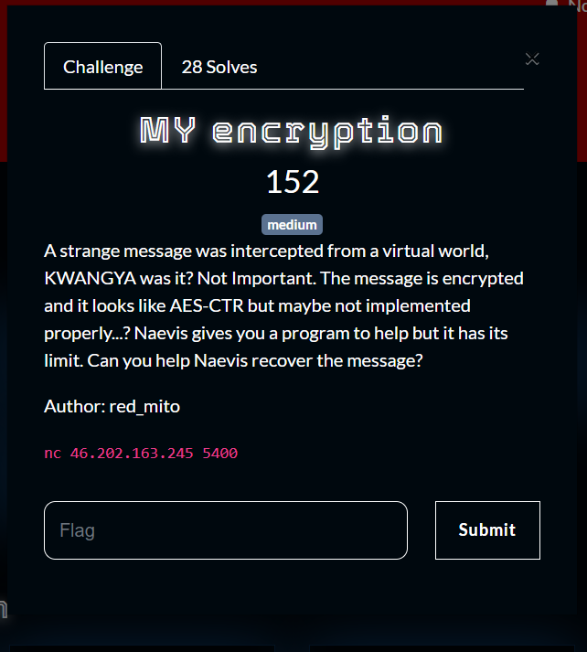
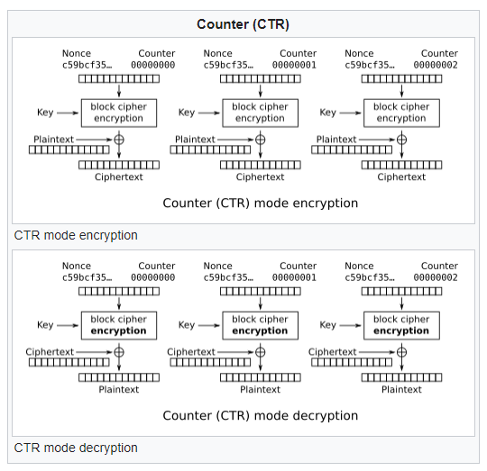
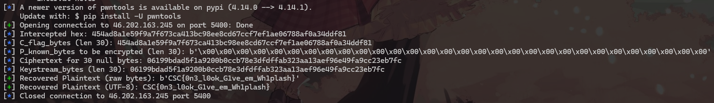
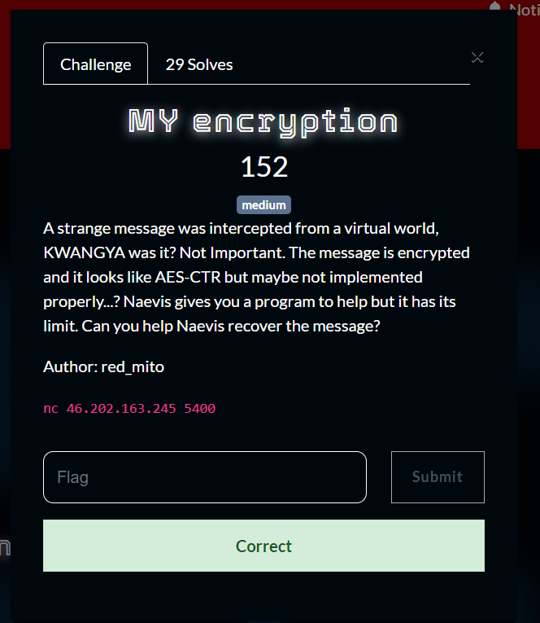

What you need to solve :
- Basic concept of AES-CTR
- Basic concept of xor

---



So this is a classic AES-CTR problem, the problem is because we can encrypt anything ourselves we can actually recover the actual flag value.

Url : https://en.wikipedia.org/wiki/Block_cipher_mode_of_operation



We can expect the flag to be

ct = flag ⊕ key
ourinput = user ⊕ key 

what if we input all null bytes?

(ourinput = null ⊕ key) -> keystream
flag = ct ⊕ ourinput

If the above doesnt make any sense to you, you should learn how xor works : https://stackoverflow.com/questions/2326561/xor-reversibility-operation-question

We can easily create a solver for this challenge using the help of ai.

```py
from pwn import *
import binascii

HOST = '46.202.163.245'
PORT = 5400

def get_intercepted_message(r):
    r.sendlineafter(b'Enter your choice: ', b'2')
    r.recvuntil(b'Message: ')
    intercepted_hex = r.recvline().strip().decode()
    log.info(f"Intercepted hex: {intercepted_hex}")
    return intercepted_hex

def encrypt_data(r, data_to_encrypt_bytes):
    r.sendlineafter(b'Enter your choice: ', b'1')
    r.sendlineafter(b'What do you want to encrypt: ', data_to_encrypt_bytes)
    r.recvuntil(b'Ciphertext: ')
    ciphertext_hex = r.recvline().strip().decode()
    log.info(f"Ciphertext for {len(data_to_encrypt_bytes)} null bytes: {ciphertext_hex}")
    return ciphertext_hex

def main():
    r = remote(HOST, PORT)
    C_flag_hex = get_intercepted_message(r)
    try:
        C_flag_bytes = binascii.unhexlify(C_flag_hex)
    except binascii.Error as e:
        log.error(f"Failed to unhexlify C_flag_hex: {C_flag_hex}. Error: {e}")
        r.close()
        return
    log.info(f"C_flag_bytes (len {len(C_flag_bytes)}): {C_flag_bytes.hex()}")
    P_known_bytes = b'\x00' * len(C_flag_bytes)
    log.info(f"P_known_bytes to be encrypted (len {len(P_known_bytes)}): {P_known_bytes!r}")
    C_known_hex = encrypt_data(r, P_known_bytes)
    try:
        Keystream_bytes = binascii.unhexlify(C_known_hex)
    except binascii.Error as e:
        log.error(f"Failed to unhexlify C_known_hex: {C_known_hex}. Error: {e}")
        r.close()
        return
    log.info(f"Keystream_bytes (len {len(Keystream_bytes)}): {Keystream_bytes.hex()}")
    if len(C_flag_bytes) != len(Keystream_bytes):
        log.error(f"Length mismatch! C_flag_bytes length: {len(C_flag_bytes)}, Keystream_bytes length: {len(Keystream_bytes)}")
        log.error("This indicates an issue with the attack logic or assumptions.")
        r.close()
        return

    P_flag_byte_list = [cb ^ kb for cb, kb in zip(C_flag_bytes, Keystream_bytes)]
    P_flag_bytes = bytes(P_flag_byte_list)

    log.success(f"Recovered Plaintext (raw bytes): {P_flag_bytes!r}")
    try:
        P_flag_str = P_flag_bytes.decode('utf-8')
        log.success(f"Recovered Plaintext (UTF-8): {P_flag_str}")
    except UnicodeDecodeError:
        log.warning("Failed to decode recovered plaintext as UTF-8. It might be binary data or a different encoding.")
        log.info(f"Raw bytes: {P_flag_bytes!r}")

    r.sendlineafter(b'Enter your choice: ', b'3')
    r.close()

if __name__ == '__main__':
    main()
```





Flag : CSC{0n3_l0ok_G1ve_em_Wh1plash}