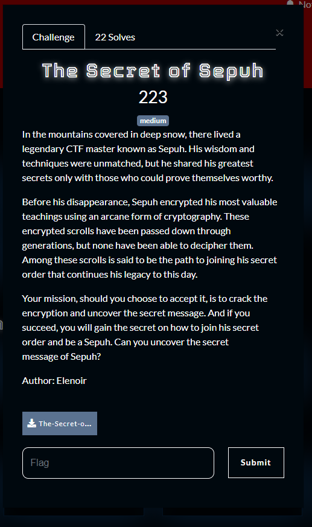
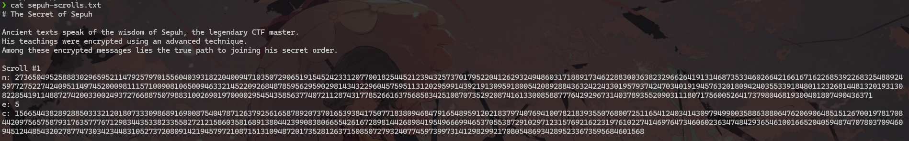
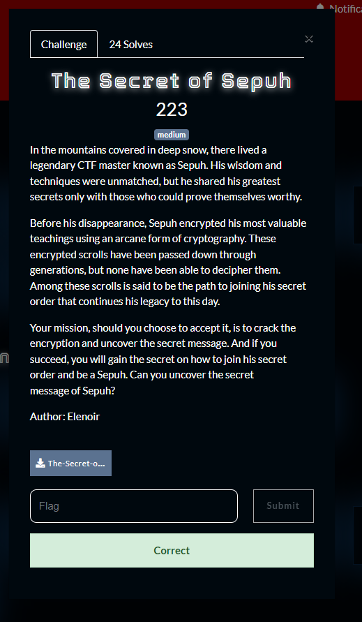

What you need to solve :
- Basic concept of RSA
- Basic math

---

```
❯ ls
encryption.py  sepuh-scrolls.txt
```

Starting the challenge we were given 2 files, first the `sepuh-scrolls.txt`.



That seems to contain large amount of data.

```py
❯ cat encryption.py
import random
from Crypto.Util.number import getPrime, bytes_to_long

with open('flag.txt', 'rb') as f:
    flag = f.read()

msgs = [
    b'The first secret of Sepuh is discipline in training.',
    b'Patience is the second greatest virtue of Sepuh.',
    b'Honor your opponents, this is the way of Sepuh.'
]

msgs.append(flag)
msgs *= 3
random.shuffle(msgs)

with open('sepuh-scrolls.txt', 'w') as f:
    f.write("# The Secret of Sepuh\n\n")
    f.write("Find the true message of Sepuh to join the order.\n\n")

    for i, msg in enumerate(msgs):
        p = getPrime(1024)
        q = getPrime(1024)
        n = p * q
        e = 5
        m = bytes_to_long(msg)
        c = pow(m, e, n)
        with open('sepuh-scrolls.txt', 'a') as f:
            f.write(f'Scroll #{i+1}\n')
            f.write(f'n: {n}\n')
            f.write(f'e: {e}\n')
            f.write(f'c: {c}\n\n')
```

Then the important part, so this challenge is a classic rsa challenge which implements a low exponent.

As you can see in the RSA the exponent is only 5 while the primes are only 1024 numbers, which means that the exponent is too small for the short ciphertext to be divided by the modulus.

So expecting the flag to be short we can just find the square root 5 of the c without even needing to find the n to decrypt the message!

Because the modulus was never even used!

But the challenge is pretty annoying because other than the flag the challenge also added random stuff into the output, so we can try and decrypt the output until we find the flag!



Flag : CSC{k4l0_m4u_j490_j01n_moklet-sec.site}