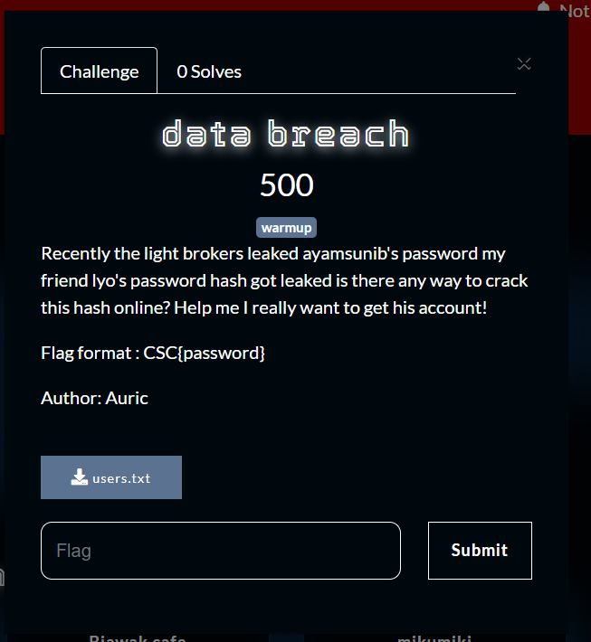
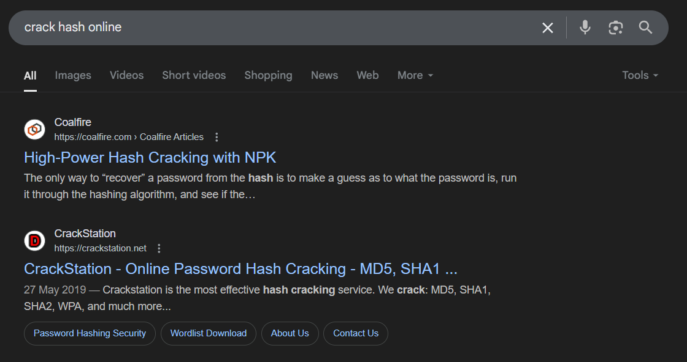
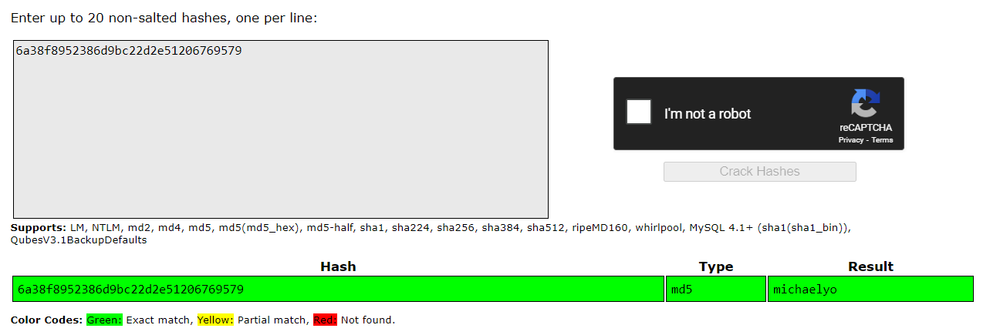
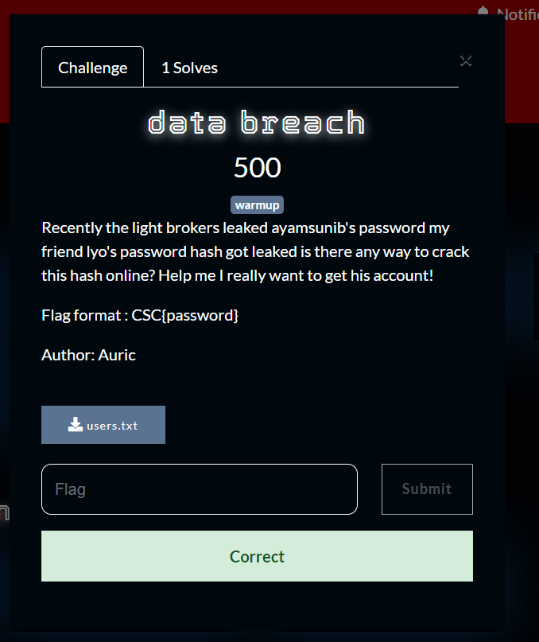

What you need to solve :
- Basic concept of hashing

---

So this challenge has the basic concept of Hashing,
the challenge says that so called `The Light Brokers` have just leaked ayamsunib's password.

From that leak it contains the author's friend password

```
michael aureliyo,6a38f8952386d9bc22d2e51206769579
```

From the file above we can clearly see a name and a weird string,
We can conclude that the name is for the username and the weird string is a thing called hash!

So everytime you create an account your password will always be hashed so that even if your password gets leaked, your account will be safe and sound!

But from weak hashing methods sometimes if your password is weak hackers can bruteforce your password!

---

The challenge says is there a way to crack hash online?
This is a huge hint that could mean that michael aureliyo's password is very weak!
lets try to find a tool online to crack hashes.



What is that crack station? it says its the most effective hash cracking service!
So lets use that.



And what do you know we actually found the real password!



Flag : CSC{michaelyo}