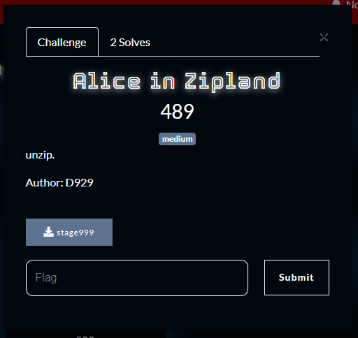
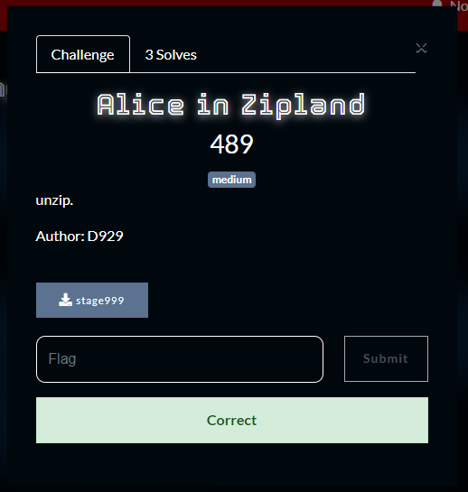

What you need to solve :
- Basic concept extracting
- Basic Research
- Basic knowledge of bruteforce

---

Literally simply just unzip unzip unzip, you can check each zip type using the file command.

```
❯ file stage996
stage996: POSIX tar archive
```

Then by research or knowledge of extracting you will end up on a protected zip, which you can bruteforce using rockyou.txt to get the password.

Which will give 2 files

```
❯ cat mad.txt
CSC{d0wn_d0wn_th3_r4bb1th0l3
```

Then the second part of the flag is in a base64 from the image meta data.



Flag : CSC{d0wn_d0wn_th3_r4bb1th0l3_0r_sh0vlD_1_s4Y_z1ph0l3}