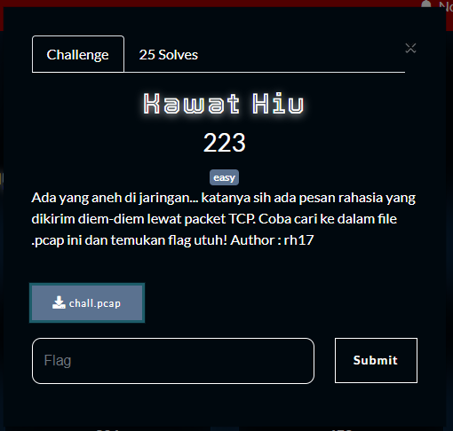
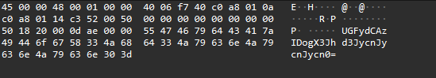
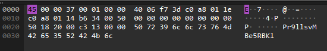
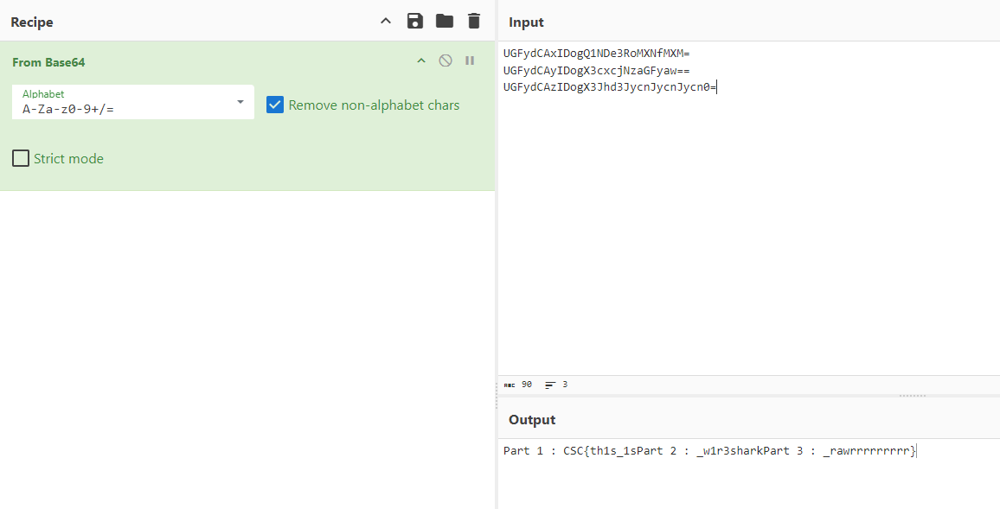
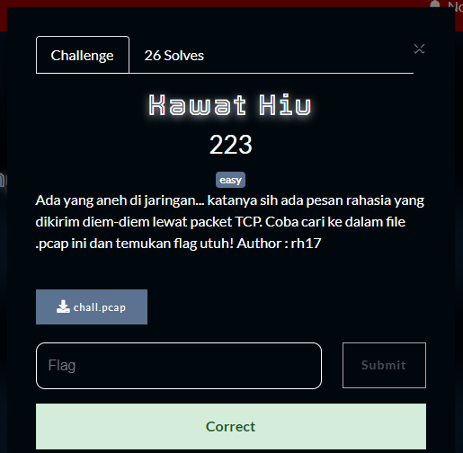

What you need to solve :
- Basic concept wireshark
- Basic concept of networks

---

Starting off the challenge we were given a pcap file, we can open this file inside of wireshark.

In some of the packets there was a base64 data.

When we compare it to a normal data

As you can see the base64 seems to be appended?
So we can just filter out the length and gain 3 base64 strings

Flag : CSC{th1s_1s_w1r3shark_rawrrrrrrrrr}