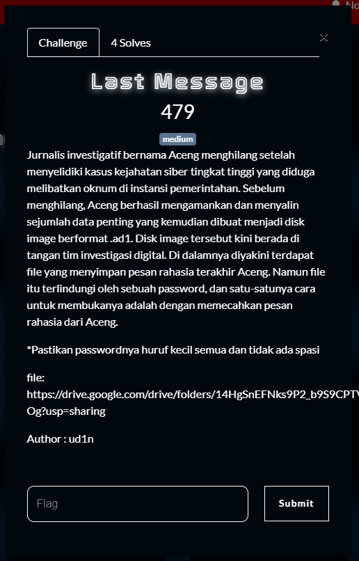
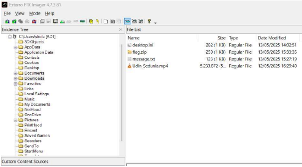
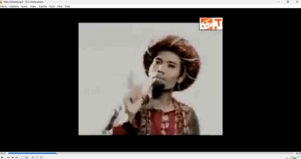
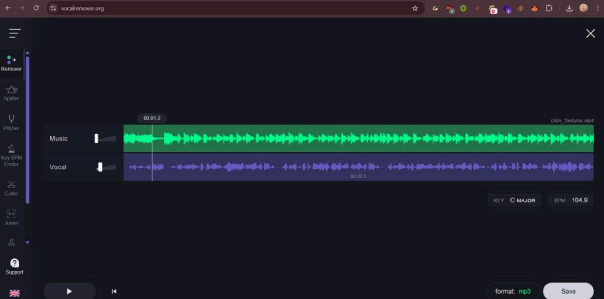
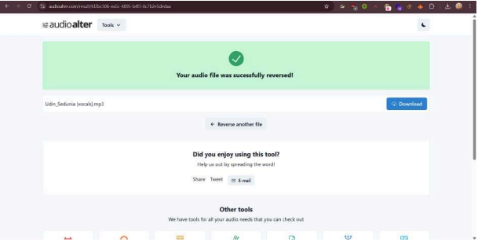
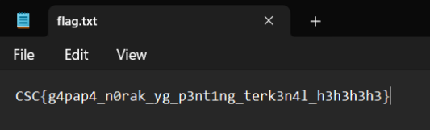

What you need to solve :
- Basic concept memory forensics
- Basic audio forensics

---

Notes : Aku gak punya memory lagi woi

Jadi aku ambil dari wu duo ku lagi @mikimiku

---

File pada link google drive tersebut adalah “challz.ad1”. Saat, dianalisis
dengan FTK Imager, kita akan menemukan beberapa file menarik di folder
Downloads.

“Message.txt” berisi “Karena soto tidak selalu lamongan, ketoprak tidak
harus cirebon, nasi ga cuman padang, dan udin sedunia bukan sekedar lagu.”
. flag.zip dipassword jadi nampaknya kita harus mendapatkan passwordnya

melalui Udin_Sedunia.mp4 dan saat video Udin_Sedunia.mp4 dibuka kita akan
melihat music video.

Tapi ada suara - suara ghoib yang terdengar di music video (tbh saya
paling benci foren tipe stego karena kadang harus analisis suara mahkluk
halus🗿tapi demi flag apa boleh buat😐) (untuk verify saya juga coba
dengerin lagu ori nya di yt).

Karena music video nya cukup keras jadi saya coba cari pemisah antara
music dan vocal dan setelah dipisah pun, suara makhluk halusnya masih
terasa horror, jadi kemungkinan ada efek yang di-apply dan saya coba
effect yang paling simpel yaitu reverse.

Dan ternyata benar, setelah direverse terdengar suara seseorang yang
memberi tahu password untuk zip yang diberi password yaitu “elonmusk3301”
dan dengan password itu kita bisa mengextract zipnya dan mendapatkan flag.

Flag : CSC{g4pap4_n0rak_yg_p3nt1ng_terk3n4l_h3h3h3h3}

Writeup Creator : Mikimiku