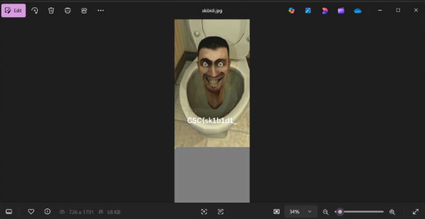

Notes : jujur aku paling malas kalau ctf ada stegano jadi aku bakal ambil wu ini dari wu teammate ku @mikimiku

What you need to solve :
- Basic concept steganography

---

Kita diberikan attachment “skibidi.jpg” dan keliatannya jpg tersebut
tercrop, jadi nampaknya kita harus coba perpanjang heightnya.

Saya mengubah hex itu pada jpg untuk memanjangkan heightnya.

Dan berikut adalah hasilnya, kita akan mendapatkan part pertama dari flag.

Bagian ke-2 flag ada di comment yang akan nampak jika kita menggunakan
exiftool.

Bagian ke-2 flag ada di comment yang akan nampak jika kita menggunakan
exiftool. (aHR0cHM6Ly9wYXN0ZWJpbi5jb20vZDIzRlNnQ1o=)

Saat value tersebut di base64 decode, kita akan mendapatkan link pastebin
yang mengandung part 2 flag. (https://pastebin.com/d23FSgCZ)

Setelah itu, saat diuji binwalk pada jpg, kita akan menemukan bahwa ada
file compressed yang diappend di akhir jpg. Kita bisa menarik file
tersebut keluar dengan hexed.it lagi, mulai dari address yang diberi tahu
di binwalk hingga ujung file.

Dengan mengextract file compressed tersebut kita akan mendapatkan part
terakhir dari flag.

Flag : CSC{sk1b1d1_s19m4_m3w1n9_4ku_br4in120t}

Writeup Creator : Mikimiku