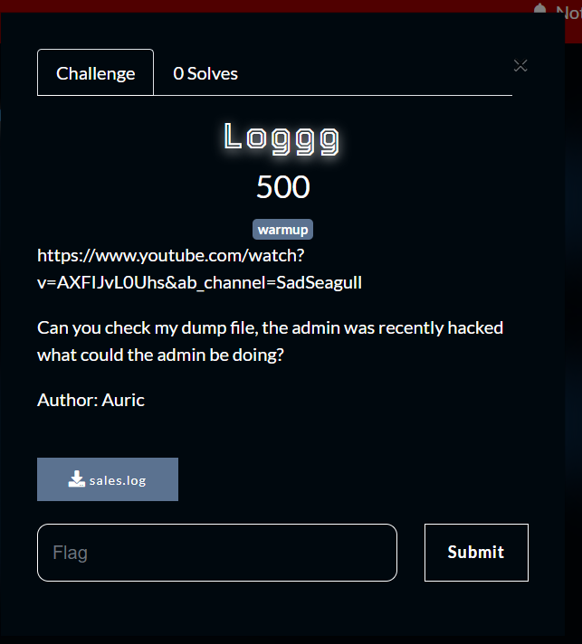

This chall is very easy and straight forward.

What you need to solve :
- Basic file searching

---

We were told that the admin was recently hacked, and our goal is to find out what the admin is doing.

We can open the file in our beloved notepad then search for the word admin!


Well well well, what do we have here?

```
Q1NDezREbTFOX0wwOXNfNHIzX3czSXJkfQ==
```

This value seems like a encoded value, we can open our favourite cyberchef

Url : 


and theres a magic button that knows that this data is base64 that gives us the flag!


Flag : CSC{4Dm1N_L09s_4r3_w3Ird}