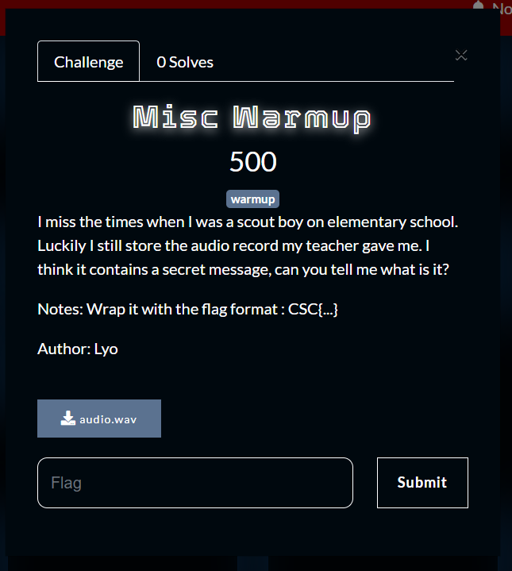
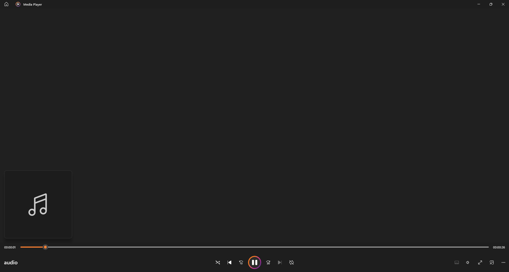
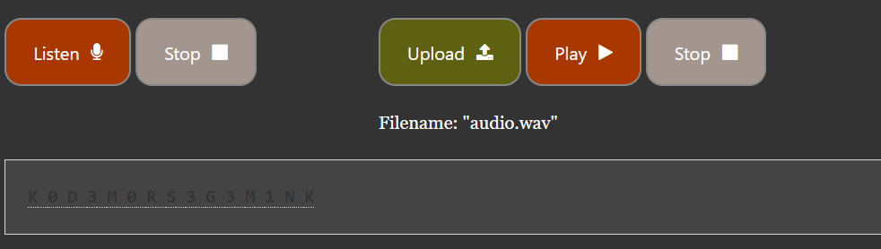
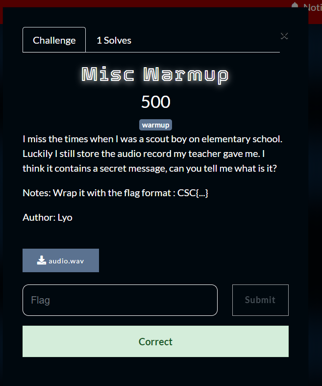

So starting the Misc challenge for warmup we were given a wav file? Interesting audio.



Listening to the audio for 2 seconds normal people will already realise that this is morse code.

Luckily we have morse code decoders online where we can give it an audio to translate.

Url : https://morsecode.world/international/decoder/audio-decoder-adaptive.html



We got the text

```
K 0 D 3 M 0 R S 3 G 3 M 1 N K
```

and we solved the challenge!



Flag : CSC{K0D3M0RS3G3M1NK}