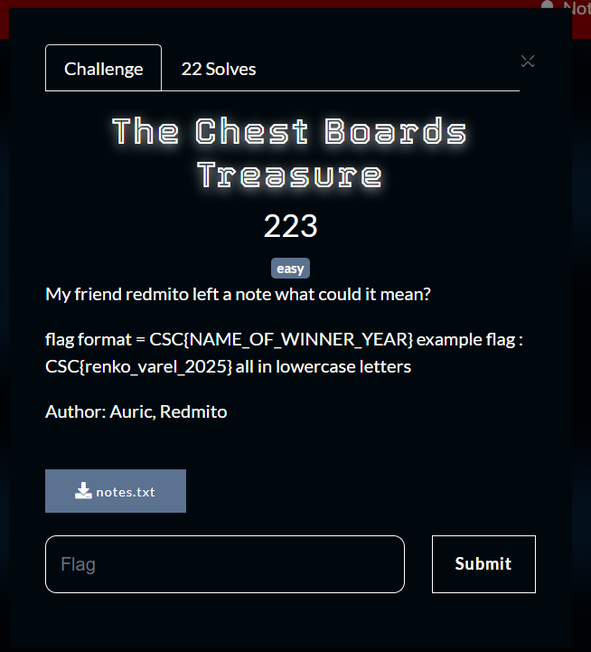
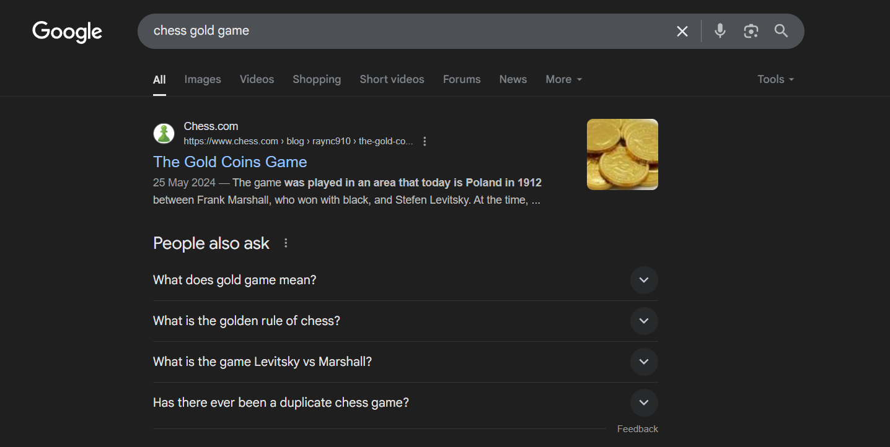
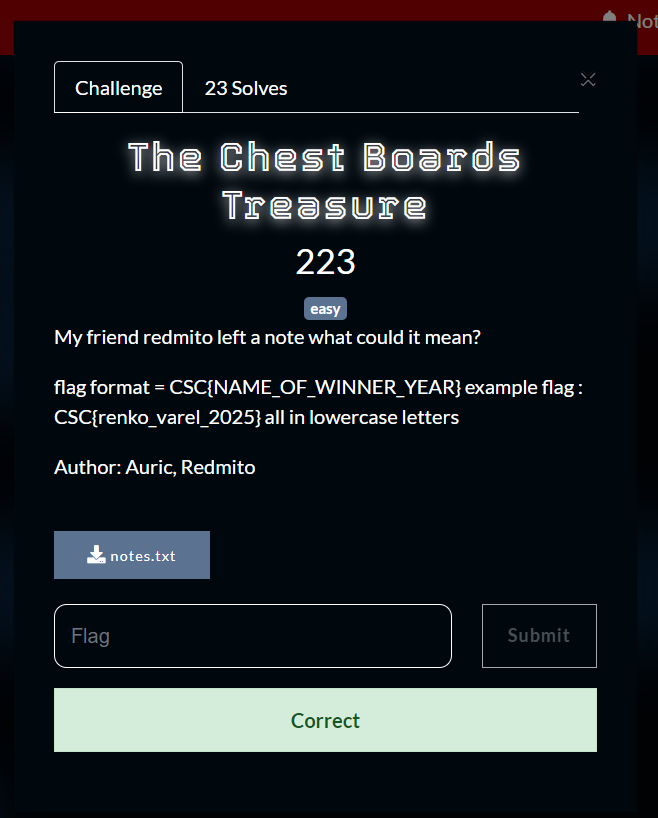

What you need to solve :
- Basic osint

---

Starting the challenge we were given a file called notes.txt that contains

```
In the heart of a bustling city, there was a quiet individual known only by the alias, Redmito. Though unassuming, Redmito possessed a peculiar talent—an encyclopedic knowledge of chess that bordered on the mystical. Wherever Redmito went, the topic of chess followed, as though the ancient game had intertwined with their very soul. But there was more to Redmito than just chess.

Redmito had an undeniable love for money and treasure. Whether it was tales of hidden vaults or legendary hoards of gold, Redmito’s eyes would light up whenever the conversation steered towards riches. It was as though their passion for chess was rivaled only by an obsession with treasure chests. Some say the gleam in their eye while discussing grandmaster matches was the same as when they spoke of gold.

Whispers began to circulate that Redmito believed chess itself held the key to unlocking a grand treasure, hidden away in some forgotten corner of the world. What others saw as just a game, Redmito saw as a map leading to untold fortune-some say by the end, the game was smothered in gold.

The moves were so legendary, they seemed to defy reality—each calculated step on the chessboard conjured gold out of thin air. It was said that with every perfect combination, shimmering gold would appear, as though the game itself was a portal to hidden riches. Redmito reveled in these tales, convinced that mastering such moves would lead not only to victory on the board but to unimaginable wealth beyond anyone's wildest dreams...
```

So if you see the key word in the notes seems to be `gold` what could that mean?



1 google search tells it all!

So the flag format is CSC{name_of_winner_year}

We can easily find this in google again, into the wikipedia : https://en.wikipedia.org/wiki/Levitsky_versus_Marshall



Flag : CSC{frank_marshall_1912}