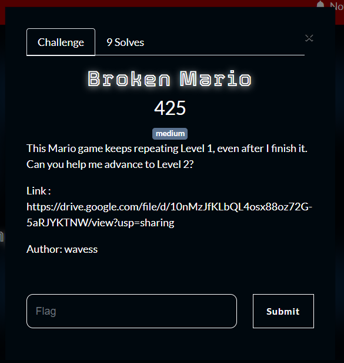
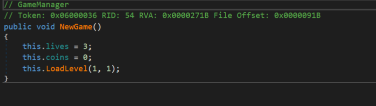
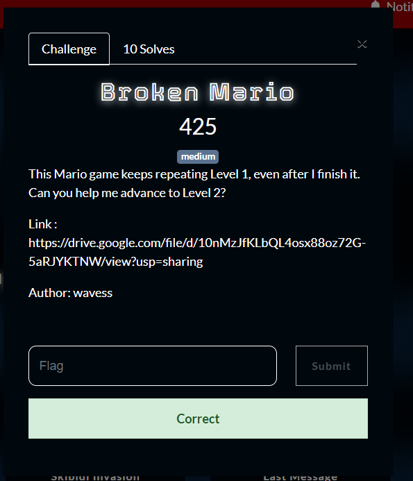

What you need to solve :
- Basic concept reverse engineering
- Basic concept of programming

---

So the level says this game always keeps repeating level 1, and our goal is to get to level 2.

We can load the game inside of dnspy to decompile the unity game!

So basicly the game will get the value of the level via a function called `LoadLevel()`, we can modify the value from `LoadLevel(1, 1)` to `LoadLevel(1, 2)` to load the second level.

But we havent solve the challenge yet!

There was a giant boss that was in our way, so my solution is to copy the jump logic of the character to the gravity of the game.
This means that we will always fly up and never down so we can fly over the boss!

we will find this qr code, scanning it from my phone i got the flag!

Flag : CSC{wow_anda_berhasil_ngehek_sebuah_gem}