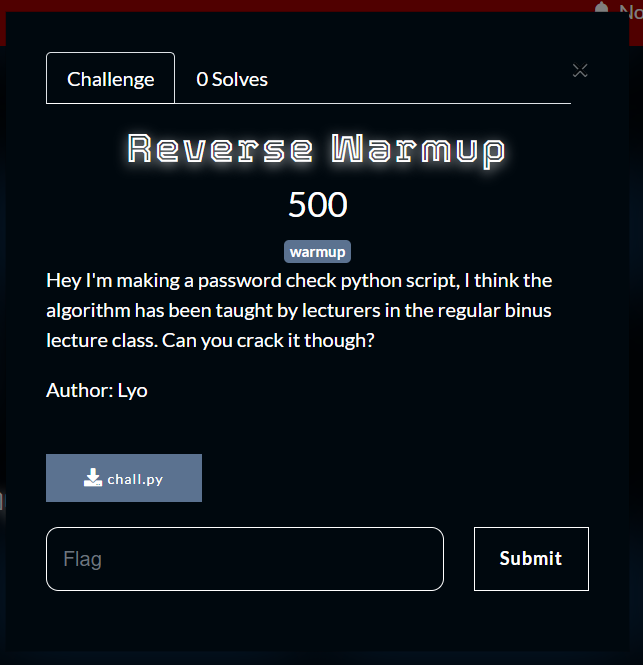
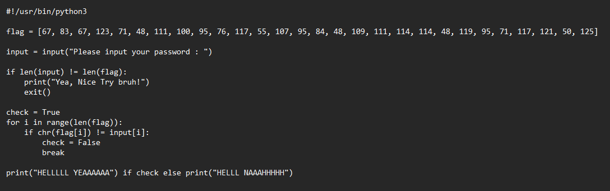
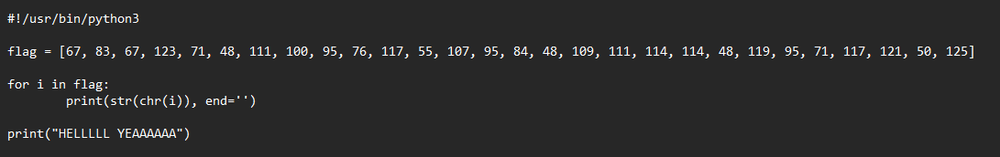
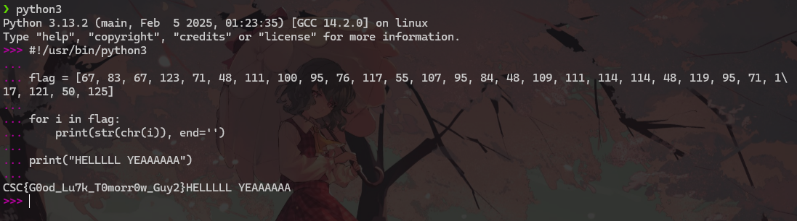
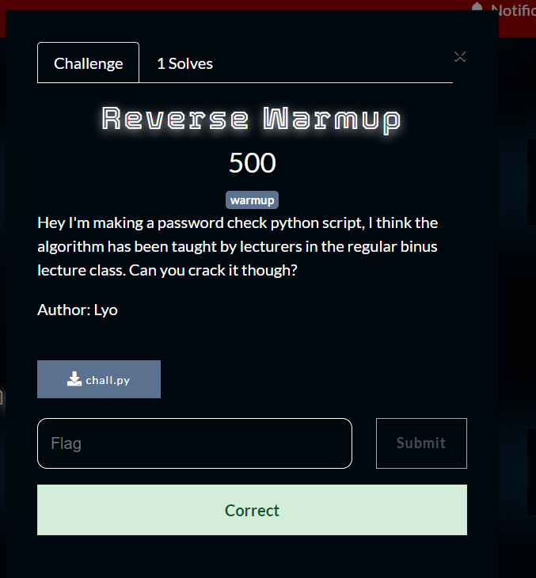

What you need to solve :
- Basic knowledge of code
- Basic knowledge of ascii

---

Starting off our warmup of our loved reverse engineering we shall download the file first.



Opening the challenge inside of notepad we can see that there is a suspicious flag array, what if we decode it from ascii? Because those values look like ascii to me.

So the part below we can just delete because it wont help us.

```
input = input("Please input your password : ")

if len(input) != len(flag):
    print("Yea, Nice Try bruh!")
    exit()

check = True
for i in range(len(flag)):
    if chr(flag[i]) != input[i]:
        check = False
        break
```



We can just use notepad to code the python code where,
`chr()` will take a number and turn it to a character in the ascii table respectively
`str()` turn the character to string to print



I will run the code from my command line, but you do you and what do you know we solved the challenge!



Flag : CSC{G0od_Lu7k_T0morr0w_Guy2}