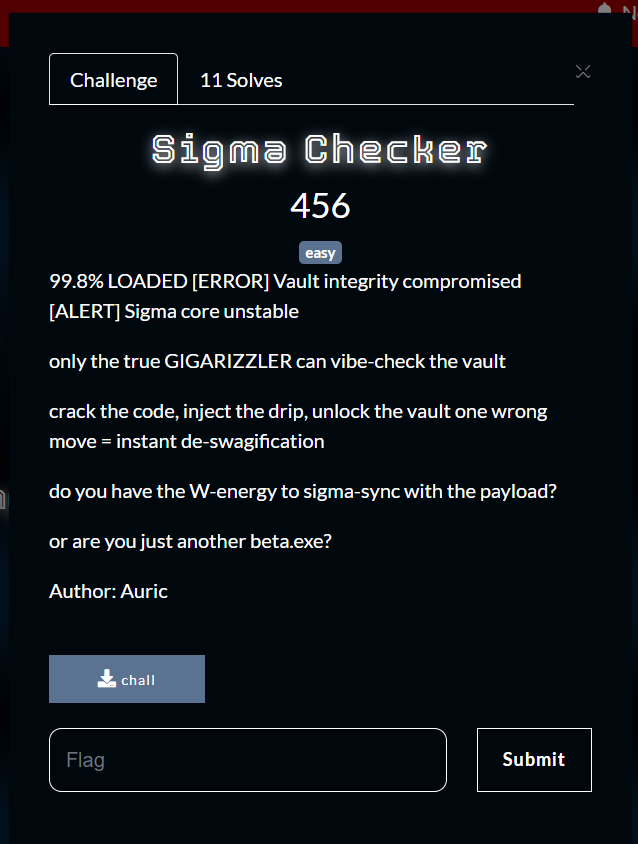
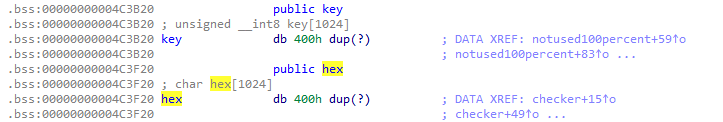
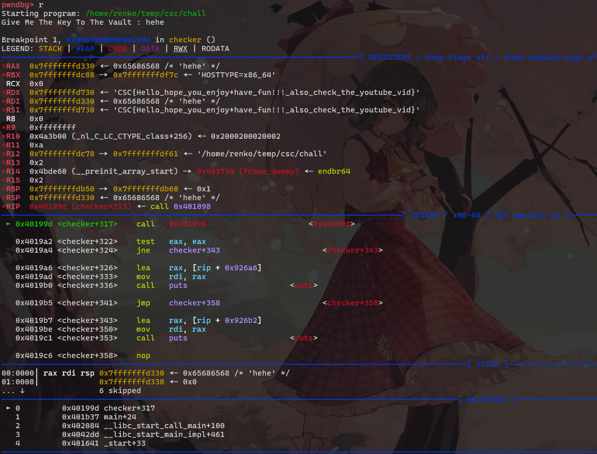
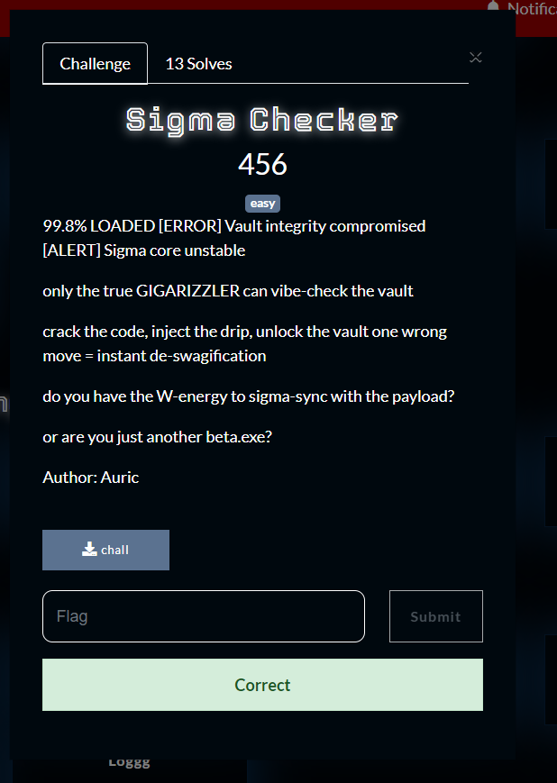

What you need to solve :
- Basic concept reverse engineering
- Basic concept of xor

---

Starting the challenge we were given a file, we can download it first for us to solve.

```
❯ file chall
chall: ELF 64-bit LSB executable, x86-64, version 1 (GNU/Linux), statically linked, BuildID[sha1]=6003dc76862794c2f007a9632270fdc0c2c7f7ca, for GNU/Linux 3.2.0, not stripped
```

So checking the file we can see that its an ELF file and that its not stripped, this means its easy for us to disassemble!

I will be using Ida-Free to solve this you can use your favourite disassembler to solve this.

Because this chall didnt use strip we can easily find the main function that looks like this in ida

```
int __fastcall main(int argc, const char **argv, const char **envp)
{
  M3pjFfKBonI(argc, argv, envp);
  checker();
  return 0;
}
```

There is a weird function thats not normal we should check it out first!

```c
__int64 M3pjFfKBonI()
{
  unsigned __int64 v0; // rbx
  __int64 result; // rax
  char v2[140]; // [rsp+0h] [rbp-A0h] BYREF
  int i; // [rsp+8Ch] [rbp-14h]

  strcpy(
    v2,
    "3a3c360f3d0709420c30054007042b1a074a295800295e2c1a242b272967090c015455543d04421000324c1f041708374b1e58313a5e2045392834134e061d12");
  for ( i = 0; ; ++i )
  {
    v0 = i;
    if ( v0 >= ((__int64 (__fastcall *)(char *))j_strlen_ifunc)(v2) )
      break;
    hex[i] = v2[i];
  }
  result = i;
  hex[i] = 0;
  return result;
}
```

So this is very simple!
Basicly it will copy the hex string to `v2` where v2 is a global variable!
then it will return result which is the length of the string, so this is basicly just a strcpy.

---

We can now go into the checker() function

```c
__int64 __fastcall checker(__int64 a1, __int64 a2)
{
  notused100percent();
  v16 = j_strlen_ifunc(hex);
  v15 = v16 / 2;
  for ( i = 0; i < v15; ++i )
  {
    a2 = (unsigned int)hex[2 * i + 1];
    v2 = hex_to_byte((unsigned int)hex[2 * i], a2);
    v13[i + 512] = v2;
  }
  v14 = j_strlen_ifunc(key);
  for ( j = 0; j < v15; ++j )
  {
    v4 = (unsigned __int8)v13[j + 512];
    v3 = v4 ^ key[j % v14];
    v13[j] = v4 ^ key[j % v14];
  }
  v13[v15] = 0;
  printf((unsigned int)"Give Me The Key To The Vault : ", a2, v3, v4, v5, v6, v12[0]);
  _isoc99_scanf((unsigned int)"%s", (unsigned int)v12, v7, v8, v9, v10, v12[0]);
  if ( (unsigned int)j_strcmp_ifunc(v12, v13) )
    return puts("unauthorized access detected!\nYou are not the sigma that holds the key, what the sigma");
  else
    return puts("You got it, great job hacker");
}
```

There is a suspicious notused100percent() function we should check that out!

```c
__int64 notused100percent()
{
  unsigned __int64 v0; // rbx
  __int64 result; // rax
  char v2[44]; // [rsp+0h] [rbp-40h] BYREF
  int i; // [rsp+2Ch] [rbp-14h]

  strcpy(v2, "youtube.com/watch?v=nC1U1LJQL8o");
  for ( i = 0; ; ++i )
  {
    v0 = i;
    if ( v0 >= j_strlen_ifunc((__int64)v2) )
      break;
    key[i] = v2[i];
  }
  result = i;
  key[i] = 0;
  return result;
}
```

So this function basicly does the same exact thing like the first function we were given!
Thats why maybe its familiar to us!

So from this info its pretty obvious!

```c
for ( i = 0; i < half; ++i )
  {
    a2 = (unsigned int)hex[2 * i + 1];
    v2 = hex_to_byte((unsigned int)hex[2 * i], a2);
    v13[i + 512] = v2;
  }
```

We basicly will unhex a string which is taken from



Basicly this both is the global variables that we copied the strings into before where

```
hex = "3a3c360f3d0709420c30054007042b1a074a295800295e2c1a242b272967090c015455543d04421000324c1f041708374b1e58313a5e2045392834134e061d12"
key = "youtube.com/watch?v=nC1U1LJQL8o"
```

Then

```c
  for ( j = 0; j < half; ++j )
  {
    v4 = (unsigned __int8)v13[j + 512];
    v3 = v4 ^ key[j % full_len];
    v13[j] = v4 ^ key[j % full_len];
  }
```

This basicly will xor the key with the hex and then save it to `v13`!

After that

```c
printf((unsigned int)"Give Me The Key To The Vault : ", a2, v3, v4, v5, v6, v12[0]);
  _isoc99_scanf((unsigned int)"%s", (unsigned int)v12, v7, v8, v9, v10, v12[0]);
  if ( (unsigned int)j_strcmp_ifunc(v12, v13) )
    return puts("unauthorized access detected!\nYou are not the sigma that holds the key, what the sigma");
  else
    return puts("You got it, great job hacker");
```

scanf is called to take our input and then compares `v12` (our input) with `v13` (the hex xored with key)!

This is massive info!!!

We can already solve this challenge!

Well you can just create a code to basicly xor the hex with the key, but im too lazy to code so i will just debug into the code in pwndbg to get the value when it strcmp.

```sh
❯ chmod +x chall
❯ gdb -q ./chall
pwndbg> disass checker
```

After seeing the disassembly from checker function we can break at the strcmp which is at

```c
   0x0000000000401984 <+292>:   call   0x404c20 <__isoc99_scanf>
   0x0000000000401989 <+297>:   lea    rdx,[rbp-0x420]
   0x0000000000401990 <+304>:   lea    rax,[rbp-0x820]
   0x0000000000401997 <+311>:   mov    rsi,rdx
   0x000000000040199a <+314>:   mov    rdi,rax
   0x000000000040199d <+317>:   call   0x401098
   0x00000000004019a2 <+322>:   test   eax,eax
   0x00000000004019a4 <+324>:   jne    0x4019b7 <checker+343>
   0x00000000004019a6 <+326>:   lea    rax,[rip+0x926a6]        # 0x494053
   0x00000000004019ad <+333>:   mov    rdi,rax
   0x00000000004019b0 <+336>:   call   0x413660 <puts>
   0x00000000004019b5 <+341>:   jmp    0x4019c6 <checker+358>
   0x00000000004019b7 <+343>:   lea    rax,[rip+0x926b2]        # 0x494070
   0x00000000004019be <+350>:   mov    rdi,rax
   0x00000000004019c1 <+353>:   call   0x413660 <puts>
   0x00000000004019c6 <+358>:   nop
   0x00000000004019c7 <+359>:   leave
   0x00000000004019c8 <+360>:   ret
```

There is a call at `0x000000000040199d` we can break at that!

```sh
pwndbg> b *0x000000000040199d
Breakpoint 1 at 0x40199d
```



We can see the value inside of RDX and RSI thats the flag!
Easy solve!



Flag : CSC{Hello_hope_you_enjoy+have_fun!!!_also_check_the_youtube_vid}