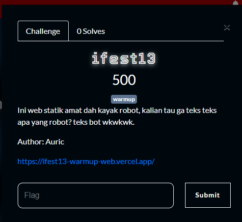
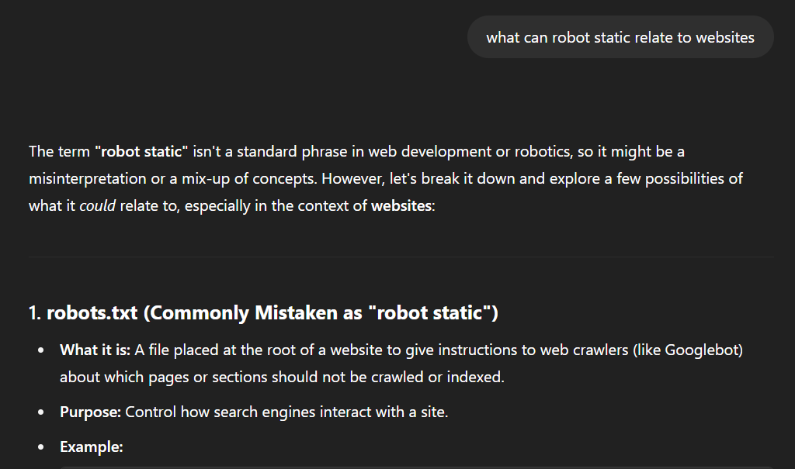
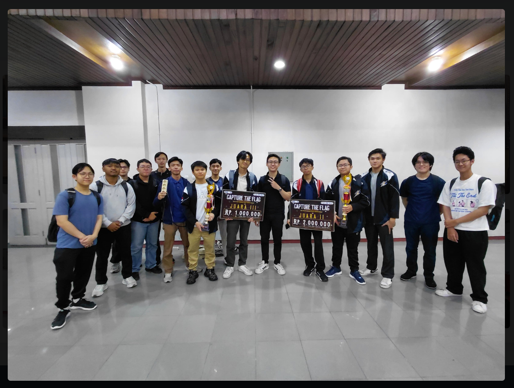
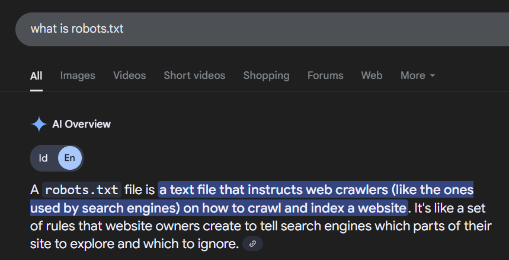
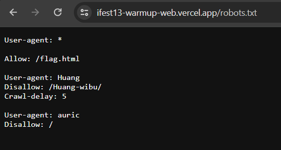
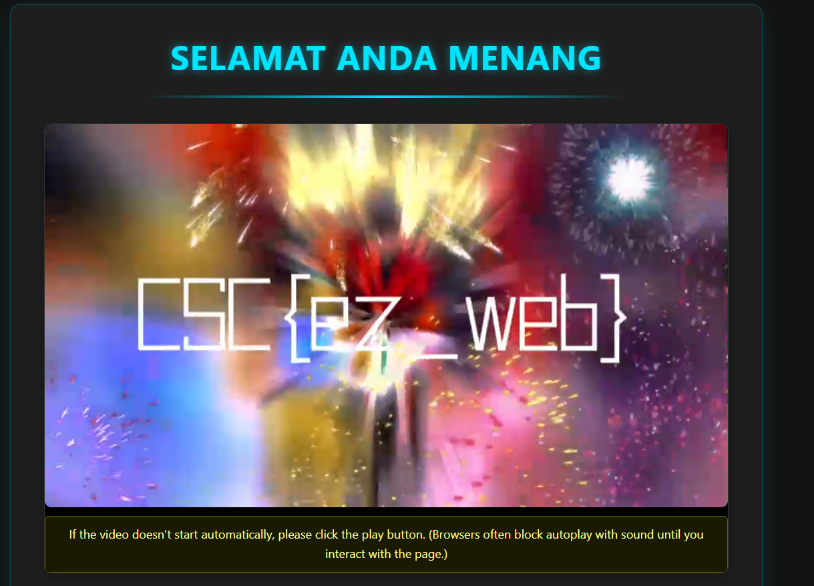
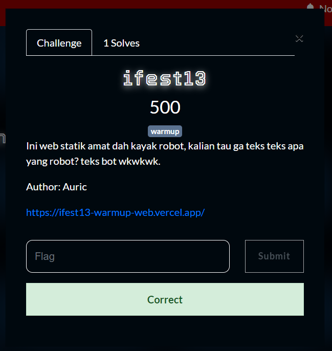

This challenge is pretty straight forward, it only requires you to know a bit about websites.

---

Solving this is quite simple, even if you have no knowledge about websites we can easily find out whats the challenge about.
We were told that the website is static like a robot, maybe this has a deeper meaning?

Using chatgpt **free** version we can even get the answer

But before solving lets pay our respect to the PETIR teams that won at IFEST 13's competition.

Going back to our challenge GPT told us to check for robots.txt what is that?

A text file to instuct web crawlers? This can mean hidden treasures!
lets check the website's robots.txt!

Seeing this aint no way your not checking the /flag.html page cause thats pretty straight forward.

Other than the peak video, we found the flag and we can submit it!

Flag : CSC{ez_web}